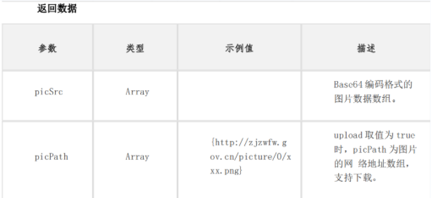

### 近期开发过程遇到的问题
#### 问题：做浙里办，浙政钉应用的时候，上传视频用base64上传，视频稍大一点会造成应用闪退
```
// 使用vant的uploader组件
upload (file) {
  const data = {
    base64: file.content
  }
  this.$http.uploadFile(data).then((res) => {
    console.log(res)
  }).catch(err => {
    console.log(err)
  })
}
```
#### 解决过程：跟后端配合排查问题发现，视频稍大，还没开始调接口应用就出现闪退，怀疑是视频文件转成base64过大造成应用功耗消耗大，内存不足闪退，后面就换成file二进制上传，成功
```
upload(file) {
  const fileObj = file.file
  const form = new FormData()
  form.append('file', fileObj)
  this.$http.uploadFile(form).then(res => {
  // this.$http.uploadFile({base64: file.content}).then(res => {
    console.log(res)
  }).catch(err => {
    console.log(err)
  })
}
```
#### 问题：安卓机在浙里办应用里使用上传组件（vant, element, 原生input）（设置了capture="camera"）时调不起相机
#### 替代方案：使用浙里办内置的jsApi

```
// upload 默认值为false，值为 true时，图片上传到服务器，上传成功后返回公网可访问的 URL。
ZWJSBridge.chooseImage({
  upload: false
}).then((result) => {
  console.log(result)
}).catch((error) => {
})
```
